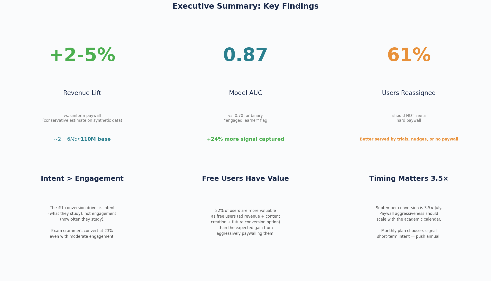
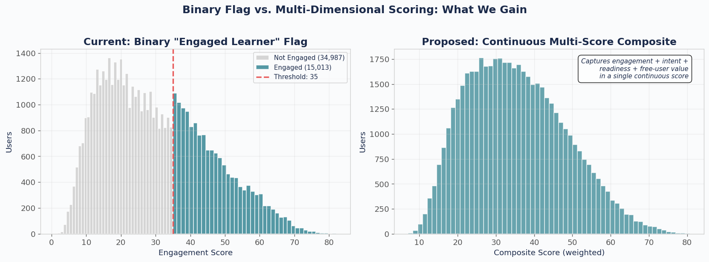
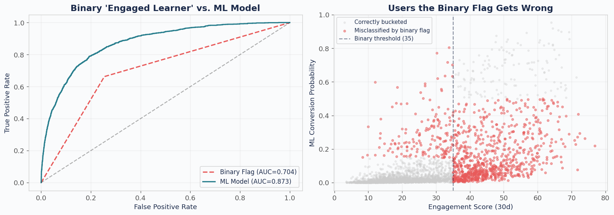
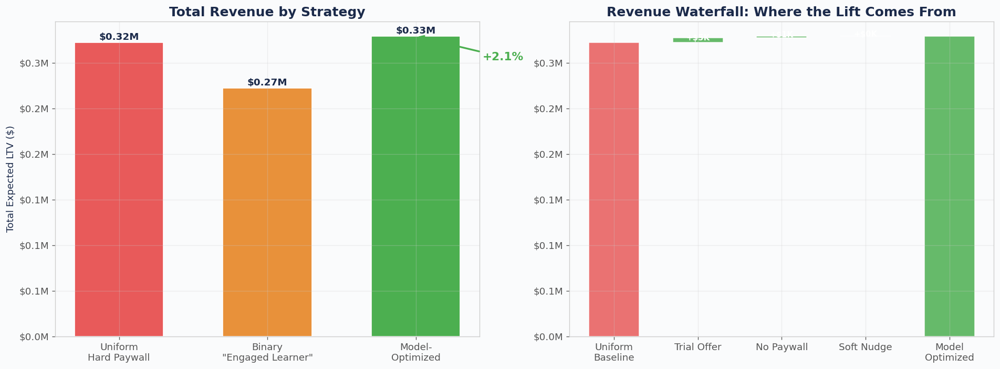
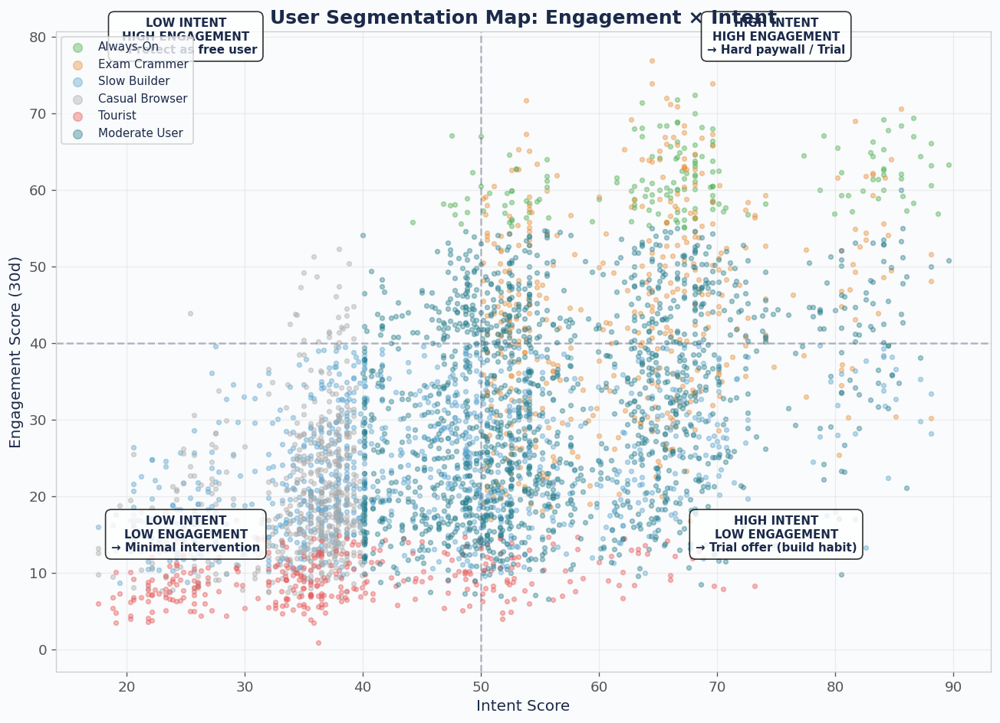
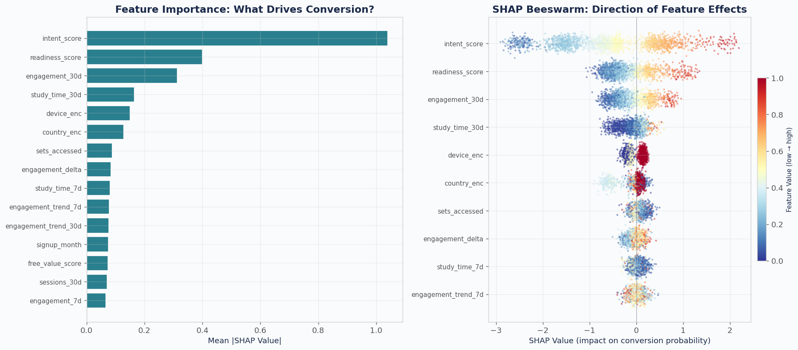

# Quizlet Paywall Optimization & User Segmentation Model

A data-driven framework for optimizing paywall strategy at Quizlet to maximize total user lifetime value. Replaces the binary "engaged learner" flag with a multi-dimensional scoring system, three ML prediction models, and a per-user paywall optimization engine.

Built on 50,000 synthetic users calibrated to public data from **Duolingo SEC filings**, **RevenueCat subscription benchmarks**, **World Bank PPP data**, and **Google Trends seasonality**.



---

## Key Results

| Metric | Value |
|--------|-------|
| ML Model AUC | **0.873** (vs. 0.704 binary flag) |
| Signal Improvement | **+24%** over binary engaged learner flag |
| Users Needing Softer Paywalls | **61%** currently over-paywalled |
| Revenue Opportunity | **~$16M+** (paywall optimization + regional pricing) |

---

## The Problem

Quizlet treats most users the same when deciding what paywall to show and how often. A pre-med student in the US cramming for the MCAT and a casual browser in Brazil see the same experience. The binary "engaged learner" flag captures one dimension (usage) but misses intent to pay, readiness to purchase, and free-user value (ad revenue, content creation).

This costs money in two directions:
- **Over-paywalling** low-intent users drives them away, losing their ad revenue
- **Under-paywalling** high-intent users leaves subscription revenue on the table

---

## Approach

### Step 1: Multi-Dimensional User Scoring

Replace the binary flag with **4 continuous scores (0–100)** computed at 7-day and 30-day windows:

- **Engagement Score** — sessions, study time, days active, trend
- **Intent Score** — subject stakes, PPP-adjusted economic capacity, channel, premium interactions
- **Readiness Score** — premium feature attempts, checkout abandonment, session acceleration, seasonality
- **Free-User Value Score** — content creation, ad impressions, class group influence, retention



### Step 2: Three Prediction Models

All three XGBoost models take ~40 features (raw data + 4 scores) and predict different outcomes:

| Model | Question | Method | Output |
|-------|----------|--------|--------|
| Conversion | Will they subscribe in 90 days? | XGBoost Classification | Probability 0–1 |
| Plan Choice | Which plan will they pick? | XGBoost Multiclass | Probability per plan |
| Retention | How long will they stay active? | XGBoost Regression | Weeks active (0–12) |



### Step 3: Paywall Optimization

For each user, compute **expected LTV under 5 paywall strategies** and assign the one that maximizes total value:

```
E[LTV] = P(convert) × Subscriber_LTV + P(stay_free) × Free_User_LTV + P(churn) × $0
```

**5 strategies:** No Paywall, Soft Nudge, Feature Gate, Trial Offer, Hard Paywall — each with calibrated conversion and churn multipliers.



---

## User Archetypes

The model identifies **6 behavioral archetypes** with distinct optimal strategies:

| Archetype | % Users | Conv. Prob | Optimal Strategy | LTV Lift |
|-----------|---------|------------|-----------------|----------|
| Always-On | 3.7% | 36.8% | Hard Paywall | +0.0% |
| Exam Crammer | 10.9% | 23.4% | Hard Paywall | +0.1% |
| Moderate User | 36.7% | 11.9% | Hard Paywall / Trial | +1.1% |
| Slow Builder | 26.2% | 4.9% | Trial Offer | +6.0% |
| Casual Browser | 14.3% | 0.8% | Trial / No Paywall | **+47.7%** |
| Tourist | 8.2% | 1.3% | Trial / No Paywall | +16.5% |



---

## Paywall Fatigue Analysis

Each additional paywall impression has **diminishing conversion benefit** and **increasing churn cost**. The model computes the optimal impression frequency per archetype:

| Archetype | Max Impressions/Month | Rationale |
|-----------|----------------------|-----------|
| Always-On | 15 | High tolerance, deeply invested |
| Exam Crammer | 11 | Time-pressured, will convert |
| Moderate User | 6 | Moderate pressure |
| Slow Builder | 4 | Let habit form first |
| Casual Browser | 2 | Easy to lose |
| Tourist | 0 | Negative EV from first impression |


---

## SHAP Analysis

Feature importance analysis reveals that **Intent Score is the #1 conversion driver** — 2.3x more important than Engagement. The current binary flag is built on the wrong signal.



---

## External Benchmarks

All parameters calibrated to public data sources:

| Source | Data Used |
|--------|-----------|
| **Duolingo 10-K (SEC)** | ~9% conversion rate, $748M revenue, 117M MAU, 9.5M subscribers |
| **RevenueCat** | 7-day trial → 40-50% conversion, iOS 1.5-2x Android, annual 2-3x monthly |
| **World Bank PPP** | Regional price sensitivity ($7.99 = $42 in India) |
| **Google Trends** | Seasonal conversion patterns (September 3.5x July) |

---

## Repository Structure

```
├── Quizlet_Paywall_Optimization.ipynb    # Full analysis notebook (6 sections, 30 cells)
├── quizlet_synthetic_users.csv           # 50,000 synthetic users × 45 features
├── charts/                               # All generated visualizations (26 PNGs)
│   ├── s1*                               # Section 1: Competitive benchmarking
│   ├── s2*                               # Section 2: User scoring framework
│   ├── s3*                               # Section 3: ML model results
│   ├── s4*                               # Section 4: Revenue optimization
│   ├── s5*                               # Section 5: Paywall fatigue
│   └── s6*                               # Section 6: Recommendations & roadmap
├── requirements.txt                      # Python dependencies
└── README.md
```

## Notebook Sections

1. **External Benchmarking & Competitive Intelligence** — Duolingo comparison, RevenueCat benchmarks, PPP analysis, seasonality
2. **User Scoring Framework** — 4-score system replacing binary flag, archetype clustering, momentum detection
3. **ML Prediction Models** — Conversion, plan choice, and retention models with SHAP interpretability
4. **Paywall Optimization** — E[LTV] framework, strategy comparison, revenue impact quantification
5. **Paywall Fatigue** — Impression frequency optimization, decay/acceleration curves, per-archetype caps
6. **Recommendations & Roadmap** — Executive summary, A/B test design, 8-week implementation plan

---

## Setup

```bash
pip install pandas numpy scikit-learn xgboost shap matplotlib seaborn
```

Open the notebook:
```bash
jupyter notebook Quizlet_Paywall_Optimization.ipynb
```

---

## Tech Stack

- **Python** — pandas, NumPy, scikit-learn, XGBoost, SHAP
- **Visualization** — matplotlib, seaborn
- **Data** — 50K synthetic users with 45 features calibrated to industry benchmarks

---

## Author

**Nijat Aliyev**
Master of Financial Engineering | UCLA | GPA 4.0
[nijatali@ucla.edu](mailto:nijatali@ucla.edu)

---

## License

MIT License — see [LICENSE](LICENSE) for details.
